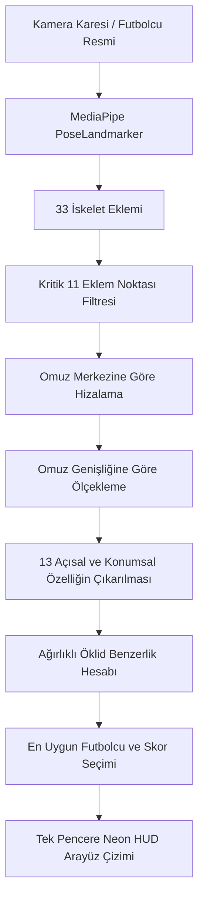

# Who Is Your Player? (Futbolcun Kim?) ⚽🤖

[](https://www.python.org/)
[](https://opencv.org/)
[](https://developers.google.com/mediapipe)
[](LICENSE)

Kameradan alınan canlı görüntü üzerinde kullanıcının vücut duruşunu ve el hareketlerini analiz ederek, ünlü futbolcuların ikonik gol sevinçleri (örneğin Arda Güler'in gökyüzü işareti, Kerem Aktürkoğlu'nun sihirli değnek hareketi, Merih Demiral'ın bozkurt sevinci) ile eşleştiren, yüksek performanslı bir **Yapay Zeka ve Bilgisayarlı Görü (Computer Vision)** uygulamasıdır. 

**MediaPipe Tasks**, **TensorFlow Lite** ve **OpenCV** kullanılarak geliştirilen bu proje; **vektör geometrisi**, **mekansal normalizasyon** ve Python ile **gerçek zamanlı GUI/HUD tasarımı** gibi ileri düzey mühendislik konseptlerini içermektedir.

---

## 🌟 Öne Çıkan Teknik Özellikler

Bu uygulama, bilgisayarlı görü ve yazılım mühendisliği alanındaki yetkinlikleri göstermek üzere şu yapıları barındırır:

### 1. Yüksek Hassasiyetli Eklem Açısı Analizi (Vektör Matematiği)
Kamera açısı veya oyuncunun kameraya uzaklığı değiştiğinde başarısız olan ham piksel koordinat eşleştirmesi yerine, bu sistem **vektör cebiri** kullanarak yapısal duruşları yakalar. İnsan eklemlerinin (örneğin dirsek ve omuz) bükülme ve açılma açılarını vektörel iç çarpım yöntemiyle tam olarak hesaplar:

$$\theta = \arccos \left( \frac{\vec{BA} \cdot \vec{BC}}{\|\vec{BA}\| \|\vec{BC}\|} \right)$$

*   **Dirsek Açıları:** Omuz, dirsek ve bilek eklemleri arasındaki bükülme derecesi.
*   **Omuz Açıları:** Üst kolların gövdeye göre açılma/kapanma derecesi.
*   **Kol Yükselme Açısı:** Üst kolun yatay düzleme göre duruş yönü.

### 2. Ölçek ve Konum Bağımsızlığı (Scale & Translation Invariance)
Kullanıcının kameraya olan mesafesinden veya ekranın neresinde durduğundan bağımsız olarak kararlı bir eşleştirme sunmak için tüm iskelet koordinatları normalize edilir:
*   **Omuz Merkezi Merkezleme:** Tüm eklem noktaları, omuzların orta noktası orijin (0,0) kabul edilerek buraya taşınır.
*   **Omuz Genişliği Ölçeklemesi:** Tüm uzaklıklar kullanıcının anlık omuz genişliğine bölünür. Bu sayede duruş boyutu dinamik olarak ölçeklenir.

### 3. Özelleştirilmiş Gerçek Zamanlı HUD Arayüzü (30+ FPS)
*   **Şeffaf Diagnostic Telemetri Paneli:** Kamera ekranının sol üst köşesine yerleştirilmiş neon tasarımlı telemetri kartı; anlık dirsek açılarını, iki bilek arasındaki mesafeyi ve ellerin havada olup olmadığını yansıtır.
*   **Canlı İskelet Rig Çizimi:** Eklemleri altın sarısı noktalar, kemikleri neon turkuaz çizgilerle birleştirip dirsek eklemlerinin anlık açı değerlerini (örneğin `135 deg`) canlı olarak ekrana yazar.
*   **Tek Pencere (Unified Canvas) Mimarisi:** Kamera görüntüsü, iskelet çizgileri, analiz grafikleri ve eşleşen futbolcu kartı tek bir `1100x650` piksellik BGR matrisinde birleştirilerek tek pencerede akıcı şekilde sunulur.

### 4. Kararlılık ve Hata Kontrolleri
*   **Buffer Eşleşme Kilidi (Cooldown):** `2.5 saniyelik` bir durum makinesi (state-machine) barındırır. Kullanıcı bir pozu doğru yaptığında sistem anında kilitlenir ve arka arkaya farklı futbolcular arasında titremeyi (flickering) önler.
*   **Bekleme Ekranı Animasyonu:** Kullanıcı kamera karşısında değilken veya hareket etmiyorken sağ panelde dairesel bir radar tarama animasyonu döner.
*   **Türkçe Karakterli Windows Dosya Yolu Desteği:** Standart OpenCV resim okuyucusu Windows işletim sisteminde Türkçe karakter içeren yollarda (`Masaüstü` vb.) çökebilir. Bu sorun, resimleri önce binary buffer olarak okuyup ardından NumPy ile decode ederek çözülmüştür:
    ```python
    with open(path, 'rb') as f:
        file_bytes = np.frombuffer(f.read(), dtype=np.uint8)
        img = cv2.imdecode(file_bytes, cv2.IMREAD_COLOR)
    ```

---

## 🛠️ Sistem Mimarisi



---

## 🏃 Kurulum ve Çalıştırma

### 1. Gereksinimler
Bilgisayarınızda Python 3.10+ kurulu olduğundan emin olun.

### 2. Projeyi Klonlayın
```bash
git clone https://github.com/ercanpolatt/whoisyourplayer.git
cd whoisyourplayer
```

### 3. Bağımlılıkları Yükleyin
```bash
python -m pip install -r requirements.txt
```
*(Alternatif olarak paketleri doğrudan yükleyebilirsiniz: `pip install opencv-python numpy mediapipe`)*

### 4. Uygulamayı Başlatın
```bash
python futbolcunkim.py
```
*Not: İlk çalıştırmada script, Google sunucularından hafif yapay zeka modeli olan `pose_landmarker.task` (9.4 MB) dosyasını **otomatik olarak indirip** dizine kaydedecektir.*

---

## 🎮 Nasıl Etkileşim Kurulur?

Kameranın karşısına geçin ve gol sevinçlerini taklit edin:
1.  **Arda Güler:** Bir elinizi göğsünüze (kalbinize) koyun, diğer kolunuzu ise işaret parmağınızla gökyüzünü gösterecek şekilde yukarı kaldırın.
2.  **Merih Demiral:** İki kolunuzu da dirseklerden bükerek başınızın yanına kaldırın ve ellerinizle bozkurt işareti yapın.
3.  **Kerem Aktürkoğlu:** İki elinizi göğsünüzün önünde birbirine yaklaştırarak sihirli değnekle büyü yapıyormuş gibi tutun.
4.  **Kenan Yıldız:** Kollarınızı kendinize çekip ikonik dil çıkarma duruşunu taklit edin.

Çıkış yapmak için aktif OpenCV penceresi seçiliyken **`Q`** tuşuna basmanız yeterlidir.

---

## 📂 Proje Yapısı

```text
├── futbolcular/           # Futbolcuların gol sevinci fotoğrafları veritabanı (PNG)
├── futbolcunkim.py        # Ana Python uygulaması kaynak kodu
├── pose_landmarker.task   # TensorFlow Lite Pose Landmark Modeli (Otomatik indirilir)
├── README.md              # Türkçe dokümantasyon
└── requirements.txt       # Proje bağımlılıkları listesi
```

---

## 📄 Lisans
Bu proje MIT Lisansı ile lisanslanmıştır - detaylar için [LICENSE](LICENSE) dosyasına göz atabilirsiniz.
