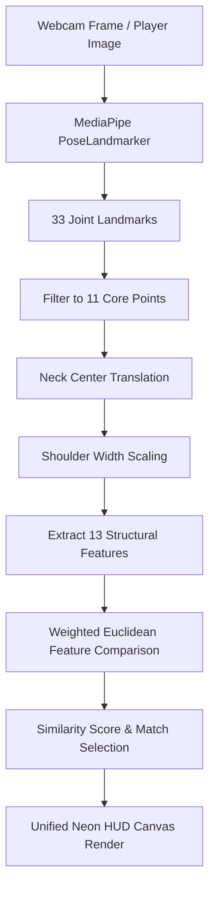

# Who Is Your Player? (Futbolcun Kim?) ⚽🤖

[](https://www.python.org/)
[](https://opencv.org/)
[](https://developers.google.com/mediapipe)
[](LICENSE)

An interactive, high-performance **Computer Vision and AI Pose Matching** application that recognizes and matches live human body gestures in real-time against a database of iconic football player celebrations (e.g., Arda Güler's sky-point, Kerem Aktürkoğlu's magic wand, Merih Demiral's wolf gesture). 

Built using **MediaPipe Tasks**, **TensorFlow Lite**, and **OpenCV**, this project demonstrates advanced concepts in **vector geometry**, **spatial normalization**, and **custom real-time GUI/HUD engineering** in Python.

---

## 🌟 Key Technical Features & Showcase

For hiring managers and technical reviewers, this application implements several core computer vision and software engineering principles:

### 1. High-Precision Joint-Angle Analysis (Vector Math)
Instead of matching raw 2D pixel coordinates (which fail when camera angles or player distances change), this system extracts structural postures using **vector algebra**. It calculates the exact flexion and extension angles of human joints (e.g., elbows and shoulders) using vector dot products:

$$\theta = \arccos \left( \frac{\vec{BA} \cdot \vec{BC}}{\|\vec{BA}\| \|\vec{BC}\|} \right)$$

*   **Elbow Angles:** Flexion/extension degrees between the shoulder, elbow, and wrist joints.
*   **Shoulder Angles:** Arm abduction/adduction relative to the torso.
*   **Arm Elevation:** The angle of the upper arm relative to the horizontal plane.

### 2. Scale & Translation Invariance
To ensure perfect matching regardless of where the user stands or how big they are in the camera frame, the system normalizes all coordinates:
*   **Neck Center Offset:** Translates all landmark coordinates to a local coordinate system centered on the midpoint of the shoulders.
*   **Shoulder Width Scaling:** Scales all offsets by dividing them by the user's current shoulder width. This acts as a dynamic bounding box scale factor.

### 3. Customized Real-Time HUD Overlay (30+ FPS)
*   **Transparent Diagnostic Overlay:** Renders a neon-styled **"Detaylı Analiz Telemetrisi"** (Pose Telemetry) card directly onto the live feed, displaying joint angles, wrist-to-wrist distances, and height flags in real-time.
*   **Live Skeletal Rigging:** Draws a custom neon-turquoise bones-and-joints layout, printing active joint degrees (e.g. `135 deg`) next to the joints dynamically.
*   **Unified Canvas Architecture:** Combines webcam feeds, diagnostic text, scanning animations, and matched player visual cards into a single `1100x650` pixel BGR frame buffer.

### 4. Robust Edge Cases & State Control
*   **Buffer Lock-On (Cooldown):** Implements a `2.5-second` cooldown state-machine. Once a pose matches with high similarity, the match is locked to prevent rapid, annoying flickering between players.
*   **Fallback Standby State:** Shows a pulsing radar-target scanning animation when no user pose is detected.
*   **Windows Unicode File Path Handling:** Standard file readers in OpenCV often crash on Windows with paths containing non-ASCII symbols (e.g., Turkish characters like `Masaüstü`). This app bypasses it by reading image files as raw binary buffers and decoding them in memory via NumPy:
    ```python
    with open(path, 'rb') as f:
        file_bytes = np.frombuffer(f.read(), dtype=np.uint8)
        img = cv2.imdecode(file_bytes, cv2.IMREAD_COLOR)
    ```

---

## 🛠️ System Architecture



---

## 🏃 Setup & Installation

### 1. Prerequisites
Ensure you have Python 3.10+ installed.

### 2. Clone the Repository
```bash
git clone https://github.com/ercanpolatt/whoisyourplayer.git
cd whoisyourplayer
```

### 3. Install Dependencies
```bash
python -m pip install -r requirements.txt
```
*(Alternatively, install packages directly: `pip install opencv-python numpy mediapipe`)*

### 4. Run the Application
```bash
python futbolcunkim.py
```
*Note: On your first run, the script will **automatically download** Google's lightweight `pose_landmarker.task` model file (9.4 MB) from Google's CDN.*

---

## 🎮 How to Interact

Strike the iconic celebrations in front of your webcam to test the matcher:
1.  **Arda Güler:** Place one hand flat on your chest (heart) and raise the other hand high, pointing your index finger to the sky.
2.  **Merih Demiral:** Raise both hands above your head/ears with bent elbows, making the wolf gesture.
3.  **Kerem Aktürkoğlu:** Hold both wrists close to each other in front of your chest as if casting a spell with a wand.
4.  **Kenan Yıldız:** Pull your arms in close and make his signature gesture.

Press **`Q`** inside the OpenCV window to exit the application cleanly.

---

## 📂 Project Structure

```text
├── futbolcular/           # PNG database of football players (transparent/stadium photos)
├── futbolcunkim.py        # Main Python application source code
├── pose_landmarker.task   # TensorFlow Lite Pose Landmark Model (auto-downloaded)
├── README.md              # Documentation
└── requirements.txt       # Dependencies
```

---

## 📄 License
This project is licensed under the MIT License - see the [LICENSE](LICENSE) file for details.
